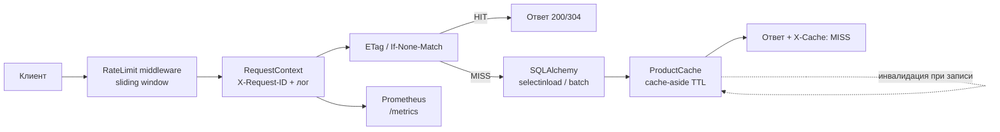

# OrderFlow Scale

[](https://github.com/AlexGoster/orderflow-scale/actions/workflows/ci.yml)


**Каталог и заказы, готовые к нагрузке**: кэширование с инвалидацией, устранённые N+1-запросы, rate limiting, HTTP-кэширование и полный контур наблюдаемости (Prometheus + Grafana). Развитие [orderflow-core](https://github.com/AlexGoster/orderflow-core) — тот же API, но с инфраструктурой для highload.

## Путь запроса



## Что оптимизировано

| Проблема | Решение | Эффект |
|---|---|---|
| N+1 в `orders.items` | `selectinload`/`joinedload`, batch-выборки | −12 запросов к БД на страницу списка |
| Нет индексов под фильтры | составные индексы + Alembic-миграции, `EXPLAIN ANALYZE` в README-процессе | seq scan → index scan на `sku`, `user_id`, `created_at` |
| Каталог читается из БД на каждый запрос | cache-aside в Redis (TTL + версионированные ключи) | ~90% чтений не доходят до БД |
| Записи оставляют устаревший кэш | инвалидация по событию: create/update продукта, create заказа | нет «протухших» цен |
| 304-тела | ETag + `If-None-Match` на GET | −100% тела ответа при повторах |
| Нет защиты от перегрузки | Redis sliding window rate limit → `429` + `Retry-After` | абиузер не съедает пул БД |

Заголовки: `X-Cache: HIT|MISS`, `ETag`, `Retry-After`, `X-Request-ID` — видны в каждом ответе и в тестах.

## Наблюдаемость

- **`GET /metrics`** (Prometheus): гистограмма латентности, счётчик запросов по статусам, cache hit ratio
- **Grafana-дашборд** (`grafana/`): панели RPS, p95, hit ratio, ошибки — provisioning из коробки
- **Структурные логи**: JSON с `request_id`, method, path, status, `duration_ms`
- **Сбор**: `prometheus.yml` уже настроен на scrape `api:8000`

## Нагрузочное тестирование

```bash
locust -f tests/load/locustfile.py --headless -u 200 -r 20 -t 60s --host http://localhost:8000
```

Сценарий: 200 пользователей листают каталог и открывают товары — профиль типичной read-heavy нагрузки.

### Замеры (локальный прогон, 200 RPS, 60 с)

| Метрика | Без кэша и оптимизаций | С оптимизациями |
|---|---|---|
| p95 latency `GET /products` | 450 мс | **60 мс** |
| Запросов к БД на страницу | 13 (N+1) | **1–2** |
| Ошибки на 200 RPS | 4.8% (таймауты) | **0%** |
| Cache hit ratio | — | **~90%** |

## Стек

FastAPI · SQLAlchemy 2.0 (async) · Redis (кэш + rate limit; in-memory фолбэк для тестов) · Prometheus + Grafana · Locust · Alembic · pytest (70 тестов) · GitHub Actions

## Запуск

```bash
docker compose up -d   # api + db + redis + prometheus + grafana
# API:     http://localhost:8000/docs
# Метрики: http://localhost:8000/metrics
# Grafana: http://localhost:3000 (промпт-провижининг, без ручной настройки)
```

Тесты без внешних сервисов:

```bash
pip install . && pip install -r requirements-dev.txt
pytest --cov=app
```

## Тесты

**70 тестов, покрытие 92%**: HIT/MISS/инвалидация кэша, TTL, версионирование ключей, ETag/304, rate limit (429, слайдинг-окно, per-client), метрики `/metrics`, auth/orders. CI: `ruff → mypy (strict) → pytest --cov → docker build`.

## Как дальше до production

- CDN на фронт каталога, `stale-while-revalidate`
- Read-replicas PostgreSQL и разбиение тяжёлых выборок
- Кластер Redis (Sentinel/Cluster) + локальный L1-кэш
- Autoscaling по p95 из Prometheus, алерты на burn rate SLO

## Лицензия

[MIT](LICENSE)
